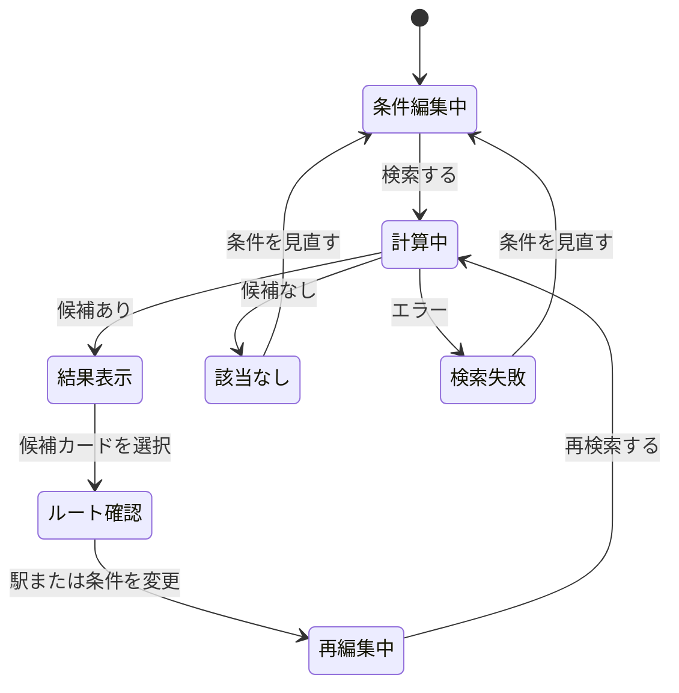

# 画面遷移設計

更新日：2026-09-18
状態：検討中

## 1. 基本方針

- モバイルを優先したレスポンシブ設計とする．
- 路線図，条件設定，検索結果を別ページへ分断せず，一つの検索ワークスペース内で扱う．
- 検索結果を確認しながら条件を変更し，繰り返し再検索できるようにする．
- URL上の主要ページ遷移より，ワークスペース内の表示状態の遷移を中心に設計する．

## 2. 基本状態

条件を変更しても，直前の検索結果は再検索を実行するまで保持する．変更後の条件と表示中の結果が一致しない場合は，「条件が変更されています」と表示する．

## 3. モバイル

### 3.1 基本配置

- 路線図を画面の主領域に表示する．
- 条件設定と検索結果は，下から開くボトムシートへ配置する．
- ボトムシートは，最小，中間，最大の3段階で開閉できる構成を候補とする．
- 候補カードを選択したときは，ボトムシートを最小または中間まで下げ，路線図上の経路を見やすくする．

### 3.2 操作の流れ

1. 定期券種別，期間，予算上限を設定する．
2. 路線図上で駅の条件を指定する．
3. 検索を実行する．
4. ボトムシートに候補カードを表示する．
5. 候補カードを選び，路線図上で経路を確認する．
6. 必要に応じて駅の条件を追加・変更する．
7. 再検索する．

## 4. デスクトップ

- 左側または中央に大きな路線図を表示する．
- 右側に条件設定と検索結果を表示する．
- 候補カードを選択しても，路線図と一覧の位置を維持する．
- 画面幅が十分にある場合は，条件設定と検索結果を同時に参照できるようにする．

## 5. 検索結果カード

- カードをタップまたはクリックすると選択状態になり，対応する経路を路線図上へ表示する．
- 別ページへの遷移は行わない．
- 両端の駅，利用路線，乗換駅を簡易経路図として表示する．
- 未達成の希望駅や購入時の注意は，存在する場合のみ表示する．

## 6. 未決定事項

- 路線図上で駅をタップした後に役割を選ぶか，役割を先に選んで複数駅をタップするか．
- ボトムシートの各段階で表示する情報量．
- 路線図の拡大，縮小，移動の操作方法．
- 検索結果の並べ替えとフィルターを開く場所．
- 初回利用者向け説明の表示方法．
