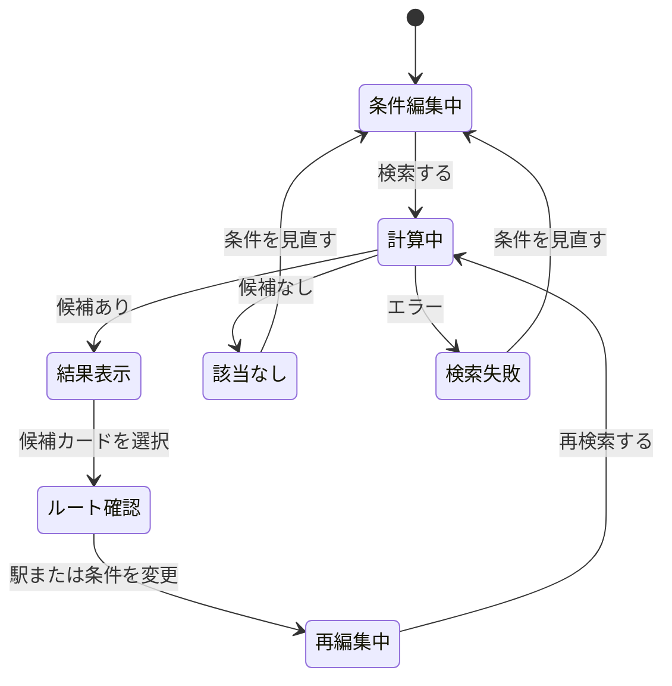

# 画面遷移設計

更新日：2026-09-18
状態：検討中

## 1. 基本方針

- モバイルを優先したレスポンシブ設計とする．
- 路線図，条件設定，検索結果を別ページへ分断せず，一つの検索ワークスペース内で扱う．
- 検索結果を確認しながら条件を変更し，繰り返し再検索できるようにする．
- URL上の主要ページ遷移より，ワークスペース内の表示状態の遷移を中心に設計する．

## 2. 基本状態

条件を変更しても，直前の検索結果は再検索を実行するまで保持する．変更後の条件と表示中の結果が一致しない場合は，「条件が変更されています」と表示する．

## 3. モバイル

### 3.1 基本配置

- 路線図を画面の主領域に表示する．
- 条件設定と検索結果は，下から開くボトムシートへ配置する．
- ボトムシートは，最小，中間，最大の3段階で開閉できるようにする．
- 最小状態では，選択条件の要約と検索または再検索ボタンを表示する．
- 中間状態では，駅の役割選択と候補カード1件から2件を表示する．
- 最大状態では，定期券種別，期間，予算，選択駅一覧，全候補，並べ替え，フィルターを表示する．
- 検索前は条件設定を中心に表示し，検索成功後は候補一覧を中心とした表示へ切り替える．
- 利用者は検索後もボトムシートを上下し，いつでも条件設定へ戻れる．
- 候補カードを選択したときは，ボトムシートを中間まで下げ，路線図上の経路を見やすくする．

### 3.2 操作の流れ

1. 定期券種別，期間，予算上限を設定する．
2. 路線図上で駅の条件を指定する．
3. 検索を実行する．
4. ボトムシートに候補カードを表示する．
5. 候補カードを選び，路線図上で経路を確認する．
6. 必要に応じて駅の条件を追加・変更する．
7. 再検索する．

### 3.3 駅の指定

- 端点，必須経由，希望経由，通らない駅の中から役割を先に選ぶ．
- 選択中の役割を画面上で常に明示する．
- 路線図上の駅を連続してタップし，同じ役割を複数駅へ割り当てられるようにする．
- 同じ役割で選択済みの駅を再度タップすると，指定を解除する．
- 違う役割で選択済みの駅をタップすると，新しい役割へ変更する．
- 端点は最大2駅とし，選択順に一方の端ともう一方の端へ割り当てる．

選択した駅は，役割ごとの色と，ピン形状または記号を組み合わせて表現する．路線自体が色分けされているため，駅の役割を色だけで判別させない．具体的な色，形状，記号はワイヤーフレームで決定する．

### 3.4 路線図の操作

- スマートフォンでは，1本指ドラッグで移動し，ピンチで拡大・縮小できるようにする．
- ダブルタップで段階的に拡大できるようにする．
- デスクトップでは，ドラッグで移動し，マウスホイールで拡大・縮小できるようにする．
- 全体表示ボタンを設け，初期表示へ戻せるようにする．
- 候補カードを選択したときは，対応する経路全体が見える範囲へ自動調整する．
- 駅名は拡大率に応じて表示量を調整し，重なりを抑える．
- 駅のタップ領域は見た目より広く確保し，ドラッグ操作との誤認を防ぐ．

## 4. デスクトップ

- 左側または中央に大きな路線図を表示する．
- 右側に条件設定と検索結果を表示する．
- 候補カードを選択しても，路線図と一覧の位置を維持する．
- 画面幅が十分にある場合は，条件設定と検索結果を同時に参照できるようにする．

## 5. 検索結果カード

- カードをタップまたはクリックすると選択状態になり，対応する経路を路線図上へ表示する．
- 別ページへの遷移は行わない．
- 両端の駅，利用路線，乗換駅を簡易経路図として表示する．
- 未達成の希望駅や購入時の注意は，存在する場合のみ表示する．

## 6. 並べ替えとフィルター

- 最大表示のボトムシート上部に，並べ替えとフィルターの操作列を固定表示する．
- 並べ替えは，おすすめ順，希望経由駅の達成数が多い順，料金区が低い順，定期範囲内の駅数が多い順から選べるようにする．
- フィルターでは，希望経由駅の最低達成数，実際の料金区の上限，定期範囲内の最低駅数を指定できるようにする．
- 有効なフィルターの件数と内容を短いチップで表示する．
- フィルター後の候補が0件の場合は，条件を緩める操作と，すべて解除する操作を表示する．

実装余力に応じて，駅名を検索し，その駅を定期範囲に含む候補だけを表示するフィルターをMVPへ追加する．最初は1駅を選択する方式とし，現在の検索結果だけを絞り込む．検索条件へ追加して再探索する操作とは明確に区別する．

## 7. 未決定事項

- 初回利用者向け説明の表示方法．
